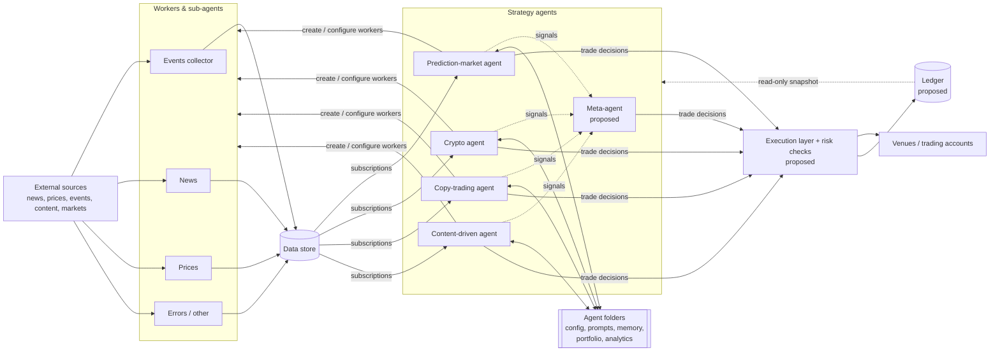
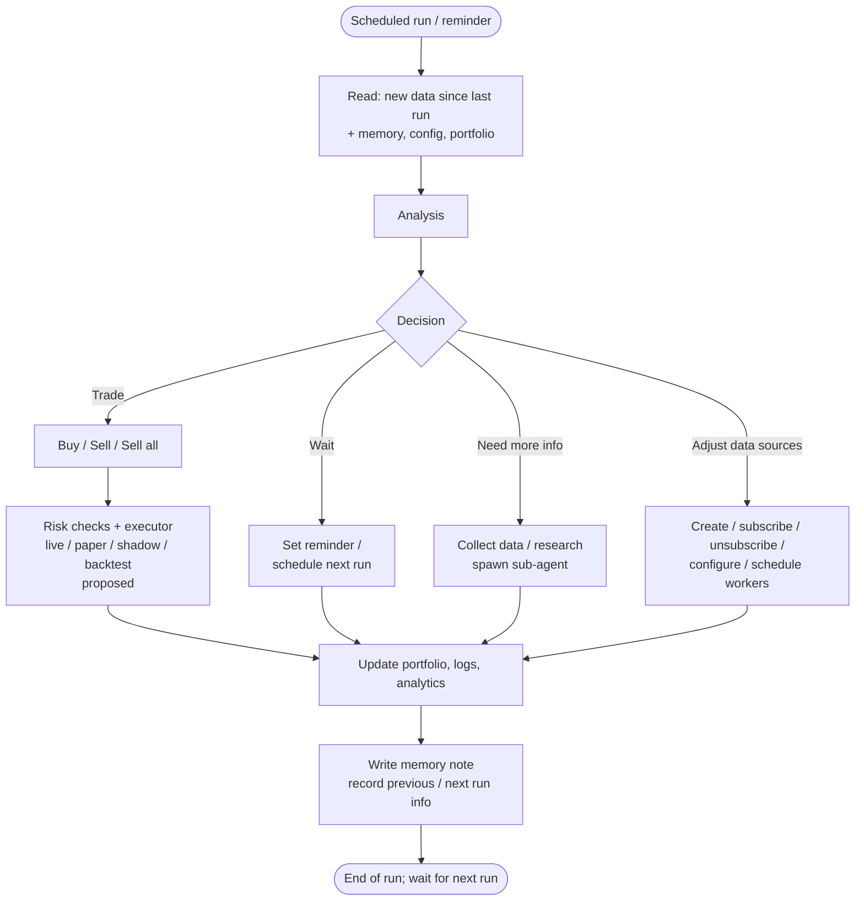

# Trading OS: High-level overview (v0.2)

> Companion to `vision.md` (v0.2). Explains how the system is meant to work. Items marked **(proposed)** come from "Ideas under evaluation" and are not decided. The folder layout is in `file-tree.md`. v0.2 additions: agent types (main, sub-agent, system-support, main domain agent, self-improvement agent), model/platform routing, interval + important-file-change triggers with cancel-and-restart, test/live mode for every acting service, the Next.js trading-ui, and the self-improvement wheel. See `vision.md` §7–13.

## 1. The idea in one paragraph

Many small **workers** continuously collect and prepare data from the outside world and put it into one shared **Data store**. Hundreds of **strategy agents**, each belonging to a domain (prediction markets, crypto, copy trading, content-driven, combinations), subscribe only to the data they need. Each agent wakes up periodically, reads what is new, analyses it, decides, and acts: trades, waits, researches, or adjusts its own data sources. Every agent lives in its own **agent folder** with its config, prompts, memory, portfolio and analytics. Because agents share a common base and differ only by domain, strategy and configuration, it is cheap to run many variants side by side, compare them, and keep what works.

## 2. Building blocks

| Block | Role |
|---|---|
| **Workers (and sub-agents)** | Scheduled scripts or agents that watch sources (events, news, prices, errors, …) and write prepared data into the Data store. |
| **Data store** | Central store of everything workers produce. Single source of data for all agents. |
| **Strategy agents** | Domain-specific decision makers. Subscribed to relevant data; run periodically; follow the run loop. |
| **Agent folder** | One per agent: config, common config, docs, logs, common prompt, agent prompt, memory, self-improvement strategy, workers & subscriptions, trading accounts, data, previous/next run info, current portfolio, analytics. |
| Execution layer **(proposed)** | Receives typed intents from agents, applies code-enforced risk checks, and executes in live / paper / shadow / backtest mode through one interface. |
| Ledger **(proposed)** | Owns the portfolio; agents get a read-only snapshot. |

## 3. How data flows from workers to agents

1. **Workers produce.** Each worker runs on its own schedule, fetches from its source, cleans/prepares the result and writes it to the Data store.
2. **Agents subscribe.** Each agent's folder lists its workers and subscriptions, so it knows which data relates to it and how/when to get it.
3. **Agents consume only what is new.** On each run an agent takes all data produced since its previous run.
   - Owner's initial idea: needed files are symlinked into the agent's folder.
   - Alternative **(proposed)**: pull-based subscriptions with a per-agent read cursor; workers don't know about agents, and data can be replayed for backtests.
4. **Context is compressed.** Raw data can be large, so compression is required (approach TBD).
   - **(proposed)**: build shared digests once upstream, let each agent filter them, and end each run with a short memory note.
5. **Agents can ask for more data.** An agent can create, subscribe to, unsubscribe from, configure or schedule workers, or spawn a research sub-agent.
   - **(proposed)**: check existing data first and limit duplicate workers.

## 4. The agent run loop

Every run follows **Read data → Analysis → Decision → Action**.

Notes:
- Trade actions pass through code-enforced risk limits **(proposed)**; external text is treated as untrusted input, so an LLM decision can never exceed hard limits.
- Not every strategy fits a periodic LLM loop. Market making and arbitrage need fast, event-driven code; strategies could be of kind *code*, *LLM* or *hybrid* **(proposed)**.

## 5. Agent lifecycle, variants and experiments

**Common base, many variants.** Every agent shares base behaviour and adds domain- and strategy-specific parts. Each can run with different configurations: initial capital, risk-management strategy, personal settings, domain settings.

**Test mode first.** Every agent has a test mode and, where possible, backtesting.
- **(proposed)**: test mode is simply an executor setting (paper / shadow / backtest) behind the same interface as live.
- **(proposed)**: LLM backtests can leak future knowledge, so paper/shadow trading is treated as the honest test.

**Self-improvement.** Every agent has its own self-improvement strategy, which is itself variable and testable.
- **(proposed)**: self-improvement produces *challengers* that run against the current *champion*; a challenger is promoted only if it performs better.

**Experiments.** The goal is to run and compare many variants, combine strategies and keep what works.
- **(proposed)**: strategies are templates; *instances* are configured runs (strategy version + capital + risk policy + model + mode). Experiments generate instances.
- **(proposed)**: meta-agents (ensembles, capital allocators) consume other agents' signals, supporting the "Combinations" domain.

Typical lifecycle:

1. Define a strategy for a domain, with base config and prompts.
2. Create one or more configured variants (capital, risk, settings).
3. Run in test mode (backtest where possible, paper/shadow).
4. Compare variants on analytics (metrics TBD: PnL, win rate, drawdown, calibration).
5. Self-improve: generate and test challengers.
6. Promote what works (to real money only under rules still to be decided); retire what doesn't.

## 6. What is still open

See `vision.md` section 6: first domain and MVP strategies, when real money starts, scale and LLM budget, venues, relation to the Polymarket suite v2, stack/hosting, human approval, self-improvement scope and metrics, agent autonomy limits, retention, key/wallet isolation, and UI.

---

## Changelog

- **v0.1** – initial overview derived from the v0.1 brief.
- **v0.2** – version bump for consistency with vision v0.2; pointer to `file-tree.md` and the new vision sections.
