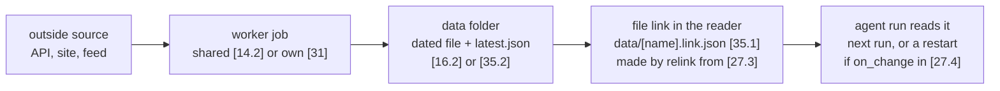
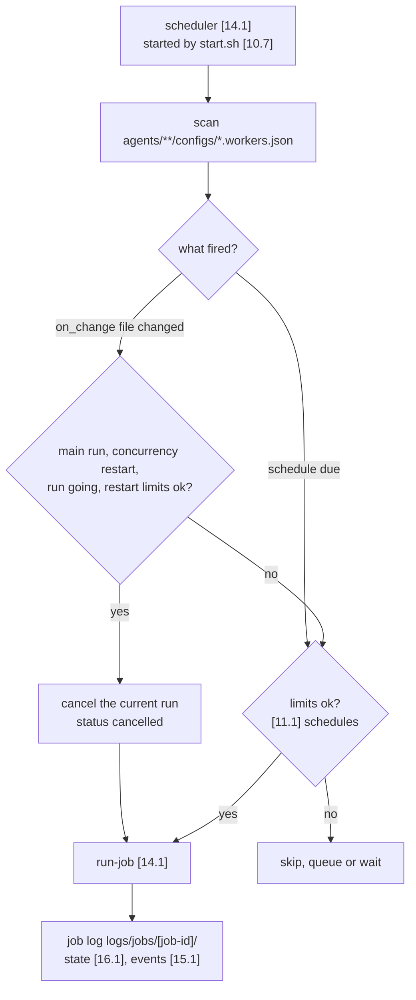
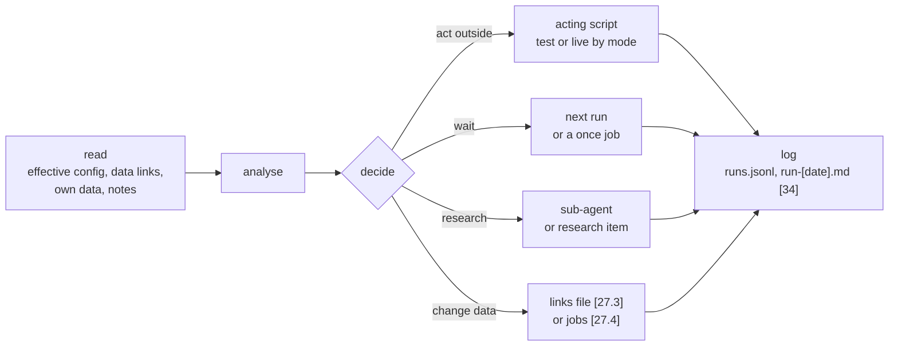
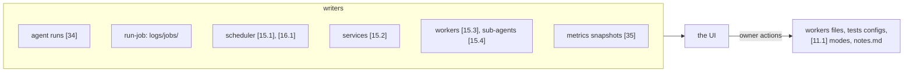
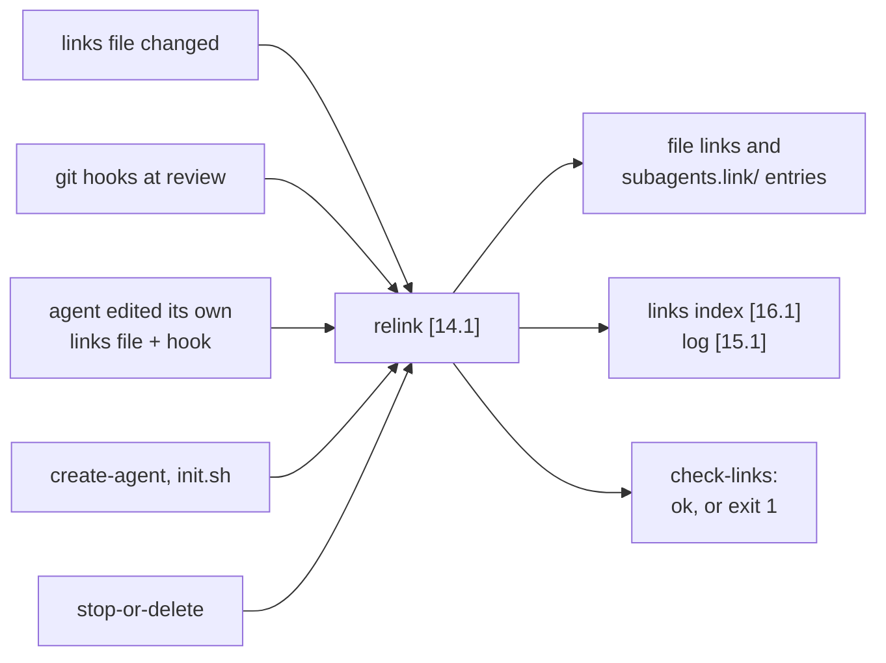
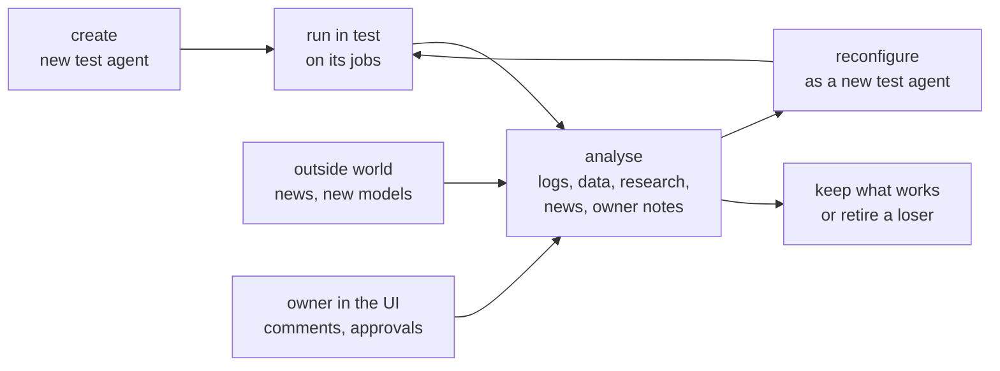
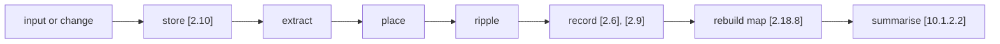

# Agent OS: Flows (v0.2)

Every flow in the Agent OS, step by step: how data moves (data flows) and what happens when the owner does something (user flows). Each flow lists its steps, the files it touches by [n] number, and who does each step; the main ones have a small diagram. This doc says what happens and in what order. File formats are in data-schemas.md, the rules the flows follow in common/shared-mechanics.md, conventions.md and safety.md, how one agent works inside in common/agent-architecture.md, and the exact runbook steps in how-to/. Nothing is built yet: the owner decided what the flows must achieve, and almost every mechanic here is our proposal, so most sections are `proposed`. The trading flows of the prediction-market domain (orders, the strategy loop, going live with money, positions on stop) are in that domain's `trading-flows.md`.

## Data flows

### Worker to agent: data, file link, agent
<!-- k: id=flow-worker-to-agent applies=[14.2],[31],[32],[16.2],[35],[35.1],[35.2],[27.3],[27.4],[11.10],[16.1] sources=in-20260929-1452,D-007,D-010,D-014,D-020,D-029,D-031 status=proposed -->
How a piece of outside data reaches the agent that needs it. The owner's model: workers collect data into a shared store, and each agent gets only the data relevant to it, through files linked into its own folder (vision.md `vis-block-workers`, `vis-block-strategy-agents`; D-020, D-031). The steps are our proposal.

1. **A job starts the worker.** The scheduler [14.1] runs the worker's job from its owner's workers file: a shared worker from [11.10], an agent's own worker from its own file like [27.4] (`flow-scheduler`).
2. **The worker fetches and writes.** It writes a dated file and replaces the stable `latest.*` next to it: shared output in `data/workers/[worker]/` [16.2], an agent's own output in `data/[worker]/` like [35.2]. Its log goes to [15.3] or the agent's `logs/`. Keys, if any, come through `load-secret` (`flow-secrets`).
3. **Optional clean step.** A clean script like [32] runs `after` the worker and writes a cleaned file next to the raw one.
4. **The reader has a link.** Every agent that needs the file lists it in its links file like [27.3], with `from` pointing at the `latest.*` file. Relink made the symlink `data/[name].link.json` like [35.1] once; it stays valid while `latest.*` is replaced (`flow-relink`).
5. **The agent reads it.** At its next run the agent reads what is new in its own `data/` and in its data links (`flow-agent-run`). If the link is in its main run's `on_change`, the change cancels and restarts the current run instead of waiting (`flow-scheduler`).
6. **Nobody copies.** The data exists once, and every reader sees the same file, read-only. The links index [16.1] records who reads what, so a new worker is added only when no job already produces the data (how-to/add-worker.md).

Open: how "new since the last run" is tracked (file times or a cursor in [16.1]); whether pull subscriptions replace links later (vision.md `vis-idea-pull`).

### Sub-agent pre-analysis and digests
<!-- k: id=flow-subagent-digest applies=[10.1.1],[19.1.1],[21.1.1],[26],[16.3],[15.4],[35.1],[11.10],[11.11] sources=in-20260929-1452,in-20260929-1455,D-008,D-018,D-021,D-029 status=proposed -->
Sub-agents take worker data and pre-analyse it for main agents (vision.md `vis-agent-types`). Proposed flow (D-021): they run in their own level's session and hand their results over as files.

1. **Job.** A `subagent` job in the owning level's workers file (e.g. `news-digest` in [11.10]) starts on its schedule, usually shortly before the agents that read it. Its model comes from the job or from [11.11].
2. **Read.** The sub-agent (`.claude/agents/[name].md` in [10.1.1], [19.1.1] or [21.1.1]) reads the new worker outputs in [16.2] or in its level's `data/`.
3. **Digest.** It writes a short Markdown digest: a dated copy plus `data/subagents/[name]/latest.md` [16.3] (a sub-agent of a lower level writes to its own level's `data/`), and one call line with its cost to [15.4].
4. **Hand over.** Agents that want it link `latest.md` (like [35.1] `news-digest.link.md`) and may add the link to their main run's `on_change`.
5. **Use.** The agent reads the digest instead of the raw data. Shared digests built once upstream are how context stays small (vision.md `vis-idea-compress-context`, an idea still to confirm).
6. **In-run sub-agents.** An agent may also call its own sub-agents [26] during a run, e.g. for research; what they write stays in its own `data/`.

### Scheduler: jobs, schedules and cancel-and-restart
<!-- k: id=flow-scheduler applies=[14.1],[10.7],[41],name:*.workers.json,[11.1],[16.1],[15.1],path:agents/**/logs sources=in-20260929-1455,in-20260930-0938,D-029,D-030 status=proposed -->
Everything an agent runs is a job in its workers file, and one scheduler runs them all (D-029). The rule for important changes is in common/shared-mechanics.md (`common-mech-triggers`); the job fields are in data-schemas.md (`schema-workers-job-fields`). The loop below is proposed.

1. **Start.** `start.sh` [10.7] starts the one scheduler process [14.1], and the OS keeps it alive. An agent's own `start.sh` like [41] only does one run.
2. **Find jobs.** It scans every `agents/**/configs/*.workers.json` (real files only, never through `subagents.link/`) and fills what a job leaves out from the file's `defaults`, then from [11.1] `schedules` and `defaults`.
3. **Register remote jobs.** Jobs with `run_on` `cloud`, `desktop` or `github-actions` are registered on their platform; the scheduler runs only `local` jobs itself.
4. **Due job.** When a `schedule` fires (`every`, `cron`, `once`, `after [job-id]` when that job succeeds, or `manual` from the UI), it checks [11.1] `schedules` (max concurrent runs, quiet hours for AI jobs, the daily AI cost cap, allowed `run_on`) and the job's `concurrency` (`skip`, `queue`, `restart`), then calls `run-job`.
5. **Run.** `run-job` [14.1] runs a script (wrapped in `load-secret` when the job has `secret_keys`), or builds the platform's headless command in the job's `workspace` (`claude -p`, `cursor-agent -p`, `codex exec`) with its model, prompt and limits. A job of type `agent` is the agent's main run: `start.sh` like [41], then `run-agent` (`flow-agent-run`).
6. **Record.** Every run goes to the owner agent's `logs/jobs/[job-id]/` (`history.jsonl`, `latest.log`); the job's state (last run, result, next run, fail count) to [16.1] `scheduler-state.json`; start, finish and failure events to [15.1]; a message to the owner as the job's `notify` says. The workers file itself never changes at run time.
7. **Important change.** The scheduler watches every job's `on_change` paths (for a link, the file behind it). After a change it waits [11.1] `triggers.debounce_sec`. If the job is a main run with `concurrency: restart` and a run is going, it cancels that run (`status: cancelled` in `runs.jsonl`) and starts a new one with `trigger: important_change`, unless `min_restart_gap_sec` or `max_restarts_per_hour` says to wait. [15.1] records `cancel_and_restart` or `wait_next_run`.
8. **Unimportant change.** A file in no `on_change` list starts nothing; the next scheduled run reads it.

Open: which machine runs the local scheduler; whether it creates cloud routines by itself or the owner confirms each; how the [11.1] `triggers` file patterns combine with each job's `on_change` list.

### Agent run loop
<!-- k: id=flow-agent-run applies=[23],[24.5],[27.2],[27.3],[27.4],[34],[35],[35.1],[46.2],[14.1] sources=in-20260929-1452,in-20260929-1455,D-021,D-029,D-031,D-056 status=proposed -->
Every run is read data, analyse, decide, act (the loop and the possible decisions: common/agent-architecture.md, `common-agent-run-loop`; how a run is started: `common-agent-run-start`). Here is what each step touches, for an agent like the example [23]. Agents at every level follow the same loop in their own folders. The prediction-market domain adds its order steps (`trading-flows.md`).

1. **Setup.** `run-agent` [14.1] merges the config (order: `common-mech-config-merge`), writes `logs/effective-config.json` [34] and starts Claude Code headless in the agent's own folder, with its own `.claude/` and `CLAUDE.md` [24.5] (D-021, proposed).
2. **Read.** Only what is new since the last run: its own `data/` [35.2], its data links [35.1], its docs (`changes.md`, owner comments in `notes.md` [46.8]), and its memory once it has a home (open).
3. **Analyse.** The model works on the digests and data it read; it may call its own sub-agents [26].
4. **Decide.** One or more decisions: act outside, wait, collect more data or research, change its data sources or jobs.
5. **Act.**
   - Act outside: only through a script, which takes test or live from the mode and checks the kill switch before every action (safety.md).
   - Wait: nothing, or a `once` job at a set time (whether an agent may add jobs to its own file is open, vision.md `vis-q-autonomy`).
   - Research: call a sub-agent, or open a research item (`flow-research`).
   - Change data sources: add or remove a link in its own links file [27.3], then rerun relink (D-031). A new worker or a change to a job's logic goes through its SI sub-agent or the owner (`flow-user-add-job`).
6. **Log.** At the end, or when cancelled: one line in `logs/runs.jsonl` (inputs, decisions, model, tokens, cost, status) and a section in `logs/run-[date].md` that ends with a one-line memory note for the next run ([34]; `schema-runs-jsonl`, `schema-run-summary-md`). The scheduler records the job run.
7. **Next run.** The next scheduled run, or an important change, starts the loop again.

### Logs and runs to the UI
<!-- k: id=flow-logs-to-ui applies=[15],[16],[15.5],[16.4],[34],[35],[2.18],[11.2],[2.20],[16.1] sources=in-20260929-1455,D-009,D-010,D-014,D-030,D-056 status=proposed -->
The owner sees every agent in full: its parts, logs, performance, the data it uses and makes, every decision, and every change being tested (decided: vision.md `vis-ui`). How the files reach the UI is proposed; whether the UI reads the files directly or through an API is open. The prediction-market domain's dashboard [45] adds the trading numbers (`trading-flows.md`).

1. **Writers.** Each agent writes its own logs [34] and data [35]; `run-job` writes job runs to the owner agent's `logs/jobs/`; the scheduler writes [15.1] and [16.1]; services, workers and sub-agents write [15.2], [15.3] and [15.4] (`common-mech-logging`).
2. **Level by level.** The UI starts at the system's `logs/` [15] and `data/` [16] and goes down one `subagents.link/` at a time: domains through [15.5.1] and [16.4.1], then each lower level through its parent's `subagents.link/` (like the domain's [19.4.1.1] and [19.5.1.1]) (D-030). Configs and jobs come the same way from [11.2.1], docs from [2.20.1].
3. **Lists.** Agents, jobs, sub-agents, services, models and links come from the index [2.18] and the links index [16.1].
4. **Numbers.** Each agent's numbers come from its metrics snapshot (data-schemas.md `schema-metrics-snapshot`; definitions in metrics.md).
5. **Back from the owner.** Owner actions write to files: a job on or off in a workers file, a test on or off in a `tests.config.json`, approvals and the kill switch in [11.1], comments in the agent's `docs/notes.md` (open, `schema-owner-comments`). Configs are read at the start of each run, so the next run follows them; the kill switch is checked before every action.

### Relink: when it runs and what it does
<!-- k: id=flow-relink applies=[14.1],name:*.links.json,name:relink.system.link.js,name:init.sh,name:settings.json,[11.10],[10.6],[16.1],[15.1],[2.18.1],path:agents/**/subagents.link/* sources=in-20260930-1153,D-030,D-031 status=proposed -->
Links follow the links files (D-031). The owner asked for relink to run when a links file changes, at review time, and when an agent edits its own links file; the list of moments is in common/shared-mechanics.md (`common-mech-relink-when`). The flow below is proposed.

| Trigger | Who starts relink | Scope |
|---|---|---|
| A links file changes | the `relink` job in [11.10] (`on_change` on `agents/**/configs/*.links.json`), plus one full run a day | `--changed`: the agents whose file changed |
| Review time | git hooks installed by the system `init.sh` [10.6]: `pre-commit`, `post-merge`, `post-checkout`; the owner approving a change in the UI | `--staged` (pre-commit, blocks the commit when a required link would break) or `--changed` |
| The agent edits its own links file | the agent runs `node scripts/relink.system.link.js` (like [30.3]), and the `PostToolUse` hook in its `.claude/settings.json` (like [24.6]) runs it too | `--agent [self]` |
| Create | `create-agent` [14.1] writes the first links file; the agent's `init.sh` like [40] runs relink | `--agent [self]`: its file links and its entries in the parent's `subagents.link/` |
| Stop or delete | the owner or an agent, after the folder is archived | whole project: removes the agent's child links, warns its readers |

What relink does each time:
1. Takes a lock (one run at a time) and works out the agents in scope, using the links index [16.1] for `--changed` and `--staged`.
2. Reads their links files (real files only) and resolves each `from`: `@system`, `@domain`, `@[level]` (a level its domain defines), or `@[name]` looked up in the registry [2.18.1]. A target that is itself a link resolves to the real file behind it, so there are no chains.
3. Refuses any target inside `.secrets/` or any `.claude/`.
4. Creates missing relative symlinks, fixes changed ones and removes `.link` symlinks that no enabled entry lists. A missing target of a `required` link is an error, and that agent's main run will not start; an optional one is a warning, with no link made.
5. Builds the child links `subagents.link/[child]/` from the folder tree and removes those whose child is gone (D-030).
6. Runs the `check-links` rules, writes [16.1] `links.index.json`, logs each change to [15.1] and prints its report (`+`, `-`, `=`, then `check ok`). With `--check` it only reports, and exits 1 on any problem.
7. The agent sees the new links at its next run; if a linked path is in its main run's `on_change`, later changes to that file restart the run.

### Secrets at execution time
<!-- k: id=flow-secrets applies=[14.1],[47.1.1],[47.2.1],[47.3],[27.2],[27.4],[11.1],[15.1],[31],name:settings.json sources=D-023,D-027,in-20260930-0812,in-20260930-0812-2,D-056 status=proposed -->
Scripts get keys at the moment they run, never before and never into a model's context (D-023, D-027). The owner decided that scripts load the keys and that agents may read and update only the test file ([47.1.1]). The rules are in safety.md; how to add a key is in how-to/add-account-or-secret.md.

1. **Declare.** The agent's config lists the key names its scripts need (`secret_keys` in [27.2]), or a `local` job lists them in its workers file like [27.4]. Names only, never values.
2. **Wrap.** `run-job` [14.1] starts the script through the loader: `load-secret [PROVIDER]_[ACCOUNT]_* -- python3 scripts/[worker-name].worker.py`.
3. **Pick the file.** The mode comes from `AGENT_OS_ENV` (default `test`). Test reads [47.1.1] `.secrets/test/.env`. Live reads [47.2.1] `.secrets/live/.env`, and only when the agent is in [11.1] `modes.live_allowlist` and the run is owner-approved, plus what its domain adds (in the prediction-market domain, an owner-approved account); otherwise the loader refuses.
4. **Hand over.** Only the declared keys, and only keys the calling agent's config references, go into the environment of that one process. A missing key fails at once with its name.
5. **Log.** [15.1] gets `keys_loaded` or `keys_refused` with the key names, mode and result, never a value. Loggers redact anything the loader resolved.
6. **Use and forget.** The script (a worker like [31], or a script that acts outside) uses the key, and the value ends with the process.
7. **Where keys never go.** Agent sessions and sub-agents get no keys; they call scripts that have them. Every level's `settings.json` denies `.secrets/live/**`. Agent tests run with no keys (`load-secret` refuses inside a test run). `cloud`, `desktop` and `github-actions` jobs get none. In test mode an agent may read `test/.env` itself when no script provides a key (D-027).
8. **Test and live.** Both files use the same key names, so no code changes between modes; only the file and the values do. Adding or renaming a key updates [47.3] in the same change (`schema-secrets-index-sync`).

### Tests: from config to results
<!-- k: id=flow-tests applies=[14.1],name:tests.config.json,name:run-tests.system.link.js,name:tests.jsonl,name:[test-id].test.md,[10.8],[19.12],[21.12],[49],[2.11.4] sources=in-20260929-2036,in-20260929-2059,D-025 status=proposed -->
Every level keeps its tests in `tests.config.json` files, and one shared script runs them and writes the results back (D-025, owner request). How to add or run a test: how-to/add-or-run-tests.md.

1. **Start.** By hand with the runner link in a test folder (`node tests/agents/run-tests.system.link.js`), for both kinds with the level's `scripts/run-tests.system.link.js` (like [30.2]; also `npm test`), from the UI, from the scheduler, or at promotion (`--schedule before_promote`).
2. **Pick.** `run-tests` [14.1] reads where it was called from: from `tests/agents/` it runs kind `agents` with that folder's config, from `tests/scripts/` kind `scripts`, from the level's `scripts/` both. It runs every `enabled` test that matches `--id` or `--schedule`.
3. **Script test.** Node or pytest on fixtures, with no network and no secrets.
4. **Agent test.** The fixtures go into a temporary copy of the level's folder, and Claude Code runs headless there with the scenario from `[test-id].test.md`, the level's `.claude/` and the model from [11.11]. The mode is forced to test; there are no secrets and no live actions. Script checks grade the transcript, the files written and the decision calls first; a judge sub-agent only for fuzzy expectations.
5. **Write back.** `last_run`, `last_result`, `last_duration_ms` and `fail_count` go into the `tests.config.json`, and one line per test into the level's `logs/tests.jsonl` (like [34.2]).
6. **Follow up.** A failure gets a `next_action` from the test's owner, usually the level's SI sub-agent. The UI shows the state, and the owner turns tests on or off there.
7. **Readers.** SI sub-agents before they change things, promote-to-live (every enabled test must pass), and the metrics snapshot (`metric-tests`).

Open: how a test's own `schedule` (`on_change`, `interval:[x]`) reaches the scheduler, which reads only workers files (proposed: one `run-tests` job per level in its workers file); whether a failing test blocks the agent's runs or only its promotion ([49]).

### Research recording
<!-- k: id=flow-research applies=path:agents/**/research/index.json,name:[research-id]-[slug],[10.9],[19.13],[21.13],[50],[10.1.12],[19.1.12],[21.1.12],[2.6] sources=in-20260929-2036,D-025 status=proposed -->
Every level keeps a history of its research: what was asked, what was found, what was decided (D-025, owner request). How to record an item: how-to/record-research.md.

1. **Question.** The level's SI sub-agent finds one, the owner asks, or an agent of any level needs an answer.
2. **Look back.** The researcher reads the level's `research/index.json` first, so no work is repeated. Research usually sits at the level it serves (for example, in the prediction-market domain, research on a strategy's variants sits at the strategy level [21.13]).
3. **Open and run.** It adds an item (`planned`), creates `research/[research-id]-[slug]/README.md` with the question and method, then runs it (`running`), keeping every artifact in that folder.
4. **Close.** It closes the item (`done` or `abandoned`) with `results_summary`, `decisions` and `related`: the agents, `changes.md` entries and tests it led to.
5. **Record.** An owner decision also goes to the decision log [2.6]. The SI sub-agent keeps only a pointer and a one-line lesson in its memory (like [21.1.12]).
6. **Readers.** The SI sub-agent before new work, the level above when it compares its agents, and the UI.

### Self-improvement wheel
<!-- k: id=flow-si-wheel applies=[10.1.1.1],[19.1.1.2],[11.10],[19.2.1],[10.9],[19.13],[2.6] sources=in-20260929-1455,D-018,D-025,D-029,D-032,D-056 status=proposed -->
The owner's wheel: create, run in test, analyse, reconfigure as a new test agent, watch the outside world, with the owner in the loop (decided: vision.md `vis-wheel`). Every level has its own SI sub-agent (D-018); what each one owns and does is in common/self-improvement-templates.md. How the wheel turns at each level (proposed):

| Level | Started by | Reads | Writes |
|---|---|---|---|
| System [10.1.1.1] | its nightly `subagent` job in [11.10] | errors and costs in [15.1], the domains through the system's `subagents.link/` folders, news of models and harnesses, owner comments | research in [10.9]; route changes as new test agents; proposals for shared files marked "pending owner" in [2.6] |
| Domain (like [19.1.1.2]) | its nightly job in its workers file (like [19.2.1]) | the levels below it through its `subagents.link/` folders | comparisons, proposals for new agents, research in its `research/` (like [19.13]) |

The levels below a domain turn the wheel as their domain defines (the prediction-market domain's strategy loop: `trading-flows.md`). At every level a change goes through a new test agent, never an edit of a running one, and no SI sub-agent touches live agents or loosens a limit (`common-si-purpose`). Going live stays the owner's decision (`flow-user-promote`).

### Outside-world signals to routing
<!-- k: id=flow-outside-world applies=[10.1.1.1],[11.11],[2.18.6],[11.10],[14.2],[16.2],[16.3],[10.9],[2.6] sources=in-20260929-1455,D-011,D-018,D-029,D-056 status=proposed -->
The wheel also takes in outside signals such as related news, a new harness or a new model; the system updates the related logic and starts new agents to test the new configuration (decided: vision.md `vis-wheel`). No outside-world watcher exists yet (feature-map.md gap 10). Proposed flow:

1. **Collect.** A news or release-watch worker (shared, in [14.2], as a job in [11.10]) and a digest sub-agent write to [16.2] and [16.3]. The owner can also bring a signal as an input.
2. **Notice.** The system SI [10.1.1.1] reads them on its nightly run, together with costs and errors from [15.1]; the SIs of the lower levels read the digests that concern them.
3. **New platform or model.** It is added to [11.11] `models.config.json` with its status and listed in [2.18.6] (how-to/add-platform-or-model.md); a research item in [10.9] says why.
4. **Try it in test.** Trying a new model on an agent means a new test agent (a new version), never an edit of a running agent. For sub-agents, workers and support roles, the route change in [11.11] is proposed as "pending owner" in [2.6].
5. **Keep what works.** Agents on the new route are compared like any other (metrics.md). A winning route becomes the default of the level above, or a new `defaults_by_type` entry in [11.11].
6. **News for an agent.** News reaches agents as digests (`flow-subagent-digest`), and an SI sub-agent may turn it into a new test agent.

## User flows

### Owner input to the knowledge base
<!-- k: id=flow-user-input applies=[2],[2.1],[2.10],[2.11.10],[10.1.1.2],[10.1.2.1],[10.1.2.2],[2.18.8] sources=in-20260930-1533,in-20260930-0839,in-20260930-1841,D-033 status=decided -->
Every owner input (project chat, a thread, the File Tree page) and every change to the system goes through the knowledge agent `sys-knowledge-agent` [10.1.1.2] (D-033). The full flow is in docs/README.md ("The flow for every input or change") and in how-to/process-an-input.md; in short:

- The `knowledge-intake` skill [10.1.2.1] does it in the session that received the input. When the input is a question, the answer is stored and filed with it: an answer is knowledge too (in-20260930-1841). A `knowledge-sync` job in [11.10] (on changes under `agents/**` or `docs/inputs/**`, and nightly; proposed) picks up anything missed.
- The `file-index` skill [10.1.2.2] then rewrites every stale How it works summary, children first, up to the root.
- The owner gets two to five plain lines: what changed, what is proposed, what only the owner can answer.

### Comment or ask on the File Tree page
<!-- k: id=flow-user-file-tree-page applies=[2.10],[2.10.2],[10.1.1.2],[10.1.2.2],[2.13] sources=in-20260929-2044,in-20260930-0722,in-20260930-0753,in-20260930-0744,in-20260930-1533,in-20260930-1841,D-033 status=decided -->
What happens when the owner writes on the File Tree page (the planning explorer of this knowledge base). What the owner wants from the page: vision.md `vis-explorer`.

1. **Open.** The owner clicks a file or folder. Its How it works summary (from its `[name].index.md`, D-039) shows first, then the other tabs: the file itself, the example, notes and history, questions, and custom tabs such as Variables.
2. **Write.** Under the tab the owner types a message and presses Send, edits the File tab, adds a comment, or edits a custom table.
3. **Question.** The page's AI answers, and the question and its answer are kept with that file's data and saved together: the answer is knowledge too (in-20260930-1841).
4. **Request.** The page drafts the update and shows which files changed (a button per path) and which fields (a button per field that shows only that field's change). Save applies it on the page at once.
5. **Every message is an input.** Each message and each applied edit is saved in the page's own store as an input for the knowledge agent (D-033). The tree's Changed view lists what changed since the last sync.

#### At the next sync
<!-- k: id=flow-user-file-tree-sync applies=[2.10],[2.10.2],[10.1.1.2],[10.1.2.1],[10.1.2.2],[2.18.8],[11.10] sources=in-20260930-0819,in-20260930-1533,in-20260930-1841,D-033 status=proposed -->
1. The knowledge agent [10.1.1.2] reads the new page inputs (the page store's `inputs` with status `new`, and its `changes` records), in its own session or through the `knowledge-sync` job in [11.10].
2. It runs `knowledge-intake` [10.1.2.1] on each: the text is stored word for word in [2.10] (a question with its answer) and listed in [2.10.2]; an applied page edit counts as the owner's proposal for the text, but the agent places the knowledge itself, because an old page draft can carry text that later decisions replaced.
3. It rebuilds the map [2.18.8], refreshes the stale How it works files (D-039), rebuilds the explorer data and republishes the page.
4. Each processed page input gets `status: processed` and `processed_into`, and the Changed view starts again from this sync.

### Create an agent
<!-- k: id=flow-user-create-agent applies=[2.11.1],[14.1],[10.1.5],[19.1.5],[2.18.1],[11.11],[27.2],[27.3],[27.4],[40] sources=in-20260929-1455,D-012,D-022,D-029,D-031,D-032,D-056 status=proposed -->
The owner, or the system itself, gives an input, and the system knows how to create the agent and plug it in (decided: vision.md `vis-wheel`). Runbook: how-to/create-agent.md. What happens:

1. **Input.** The owner says "create a new agent based on this input" in the UI or the chat, and the input is stored first (`flow-user-input`). New versions of an agent usually come from an SI sub-agent instead (`flow-si-wheel`).
2. **Plan.** The level above plans it: the system agent [10.1.5] for a new domain, the domain agent (like [19.1.5]) for the levels its domain defines (the prediction-market domain's strategies and variants: `trading-flows.md`).
3. **Scaffold.** `create-agent` [14.1] checks the name against the format and the registry [2.18.1], reserves it, scaffolds the standard folder, and writes the config, links file and jobs file (like [27.2], [27.3], [27.4]).
4. **Link.** The agent's `init.sh` like [40] installs its dependencies and runs relink: its file links and its entries in the parent's `subagents.link/` folders (`flow-relink`).
5. **Route, test, register.** Its route goes into [11.11]; its tests run (`flow-tests`); it gets a row in [2.18.1] and shows in the UI.
6. **First runs.** The scheduler finds the new workers file and starts the main run in test mode (`flow-scheduler`); the owner sees the first runs in the UI.

### Add a worker or job
<!-- k: id=flow-user-add-job applies=[2.11.2],name:*.workers.json,[14.2],[31],[10.1.1],[27.3],[2.18.2],[16.1],[14.1] sources=in-20260929-1452,in-20260930-0938,D-029,D-031 status=proposed -->
The owner sees, changes and turns off everything an agent runs in its workers file (D-029, decided). Runbook: how-to/add-worker.md.

1. **Need.** The owner, an agent or an SI sub-agent needs data or a recurring task.
2. **Reuse first.** The index [2.18.2] and the links index [16.1] show whether a job already makes that data; if so, the reader only adds a link (`flow-user-link`).
3. **Build.** A worker script (agent-local like [31], or shared in [14.2] once two agents need it), or a sub-agent file in the owning level's `.claude/agents/` like [10.1.1].
4. **Job.** A job entry in the owning agent's workers file: schedule, where it runs, platform, model, outputs, `secret_keys`.
5. **Pick-up.** The scheduler rereads a workers file when it changes and runs the new job when due (`flow-scheduler`).
6. **Wire.** Readers link the output and, if they must react at once, add it to their main run's `on_change`.
7. **Owner changes from the UI.** Turning a job on or off, or moving its time, edits that job in place. A change to a job's logic (prompt, model, tools, inputs) makes a new agent version instead ([27.4]).

Open: the owner asked to set platform and model per job (D-029), while an agent's name may carry its model (the prediction-market domain's trading agents do); whether changing the model of an agent's main run is an edit or a new version is not settled.

### Add or change a link
<!-- k: id=flow-user-link applies=[2.11.9],name:*.links.json,name:relink.system.link.js,[16.1],[27.4],[46.2] sources=in-20260930-1153,D-031 status=proposed -->
Any agent can link a file it needs from the system, its own domain or a level above it, another domain, or any other agent (D-031). Runbook: how-to/add-or-change-link.md.

1. The agent, its SI sub-agent or the owner (in the UI) edits one entry in the agent's own links file.
2. Relink runs by itself (the hook, or the scheduler's `relink` job) and builds or removes the symlink (`flow-relink`).
3. The next run reads the new file; if the link is in the main run's `on_change`, changes to that file restart the run.
4. The change is written in the agent's `changes.md` under `Links` [46.6]. Whether a link change makes a new agent version is open ([27.3]).

### Review performance
<!-- k: id=flow-user-review applies=[2.16],[34],[35],[46.2],[2.18.1],[16.1] sources=in-20260929-1455,D-030,D-056 status=proposed -->
The owner wants to see each agent's performance and the full picture behind it (decided: vision.md `vis-ui`). Proposed; the prediction-market domain's strategies and variants: `trading-flows.md`.

1. The owner opens the UI: domains, then the levels below, each with its numbers (metrics.md).
2. On an agent: its runs and decisions ([34]), the data it used (its links, from [16.1]) and made ([35]), what it changes and tests (`changes.md` [46.6]), its tests and its research.
3. From there the owner comments, asks or says what to do better (`flow-user-agent-comment`), approves going live (`flow-user-promote`) or stops the agent (`flow-user-stop`).

### Promote test to live
<!-- k: id=flow-user-promote applies=[2.11.4],[2.16],[11.1],[47.2.1],[27.2],[27.4],[2.18.1] sources=in-20260929-1455,D-012,D-023,D-027,D-056 status=proposed -->
Only the owner approves an agent going live, in the UI (decided: vision.md `vis-principle-test-first`). Runbook: how-to/promote-to-live.md; criteria: metrics.md (`metric-promote-live`). Going live with money adds the prediction-market domain's steps (`trading-flows.md`).

1. **Propose.** The level above or its SI finds an agent that meets the live-candidate rules and proposes it; the owner gets `promotion_proposed`.
2. **Decide.** The owner reviews it in the UI and approves or rejects. A rejection leaves the agent in test.
3. **Keys.** On approval the owner puts its live keys, under the same names, in [47.2.1].
4. **New live agent.** A new agent is created: the same name ending in `-live`, with `parent` = the test agent (names never change). It is added to `live_allowlist`, and its jobs run `local` with `mode: live`.
5. **Run live.** Its outside actions run in live mode, and the kill switch stops every one of them at once.
6. **Twin.** The test agent keeps running as its twin or is retired; the registry [2.18.1] shows both.

### Stop or delete an agent
<!-- k: id=flow-user-stop applies=[2.11.5],[27.4],[11.1],[2.18.1],[14.1],[16.1],path:agents/**/subagents.link/* sources=in-20260929-1455,D-012,D-029,D-030,D-031,D-056 status=proposed -->
The owner can stop and delete agents from the UI (decided: vision.md `vis-ui`). Runbook: how-to/stop-or-delete-agent.md. Stopping a trading agent adds the prediction-market domain's steps (`trading-flows.md`).

1. **Stop.** Its jobs get `enabled: false` in its workers file, so no new run starts. In an emergency the kill switch in [11.1] stops every action at once.
2. **Retire.** The registry [2.18.1] marks it paused or retired; the folder stays.
3. **Delete.** The folder is archived with its logs, data, docs, tests and research. Relink removes its child links and warns every reader (`flow-relink`); the readers fix their links files.
4. **Record.** The name stays reserved for ever (D-012).

### Comment, ask or "do better" on an agent
<!-- k: id=flow-user-agent-comment applies=[46.2],[19.1.5],[10.1.5],[2.10] sources=in-20260929-1455,D-022,D-033 status=open -->
The owner can leave comments on an agent, ask it questions (answered by AI) and say what it should do better (decided: vision.md `vis-ui`). Where the UI keeps these is open (`schema-owner-comments`). A possible flow:

1. A comment or a "do better" note goes to the agent's `docs/notes.md` [46.2].
2. A question is answered by the level that owns the topic: the domain agent [19.1.5] for its domain, the system agent [10.1.5] for the whole system (D-022); the answer is written under the question.
3. The agent reads `notes.md` at its next run; its SI sub-agent reads it on its nightly run and may open research or a new test agent (`flow-si-wheel`).
4. A note that says how the system should work is also an owner input for the knowledge agent (`flow-user-input`).

### Review a proposed change
<!-- k: id=flow-user-review-change applies=[2.6],[11.1],[11.11],[2.17.3],[14.1] sources=in-20260929-1455,D-031,D-033,D-056 status=proposed -->
Some changes wait for the owner: changes to [11.1] `modes`, proposals that SI or support agents mark "pending owner" in the decision log [2.6], and changes to the common prompt [2.17.3] (all proposed rules). The prediction-market domain adds its risk limits and accounts (`trading-flows.md`).

1. The proposing agent writes what, why and which files, marked "pending owner" in [2.6].
2. The owner sees it in the UI and approves or rejects it.
3. On approval the change is applied; the approval also runs relink (review time, D-031), and the knowledge agent files the change (D-033).
4. The outcome is written on the proposal in [2.6], where the proposing agent reads it at its next run.

## Changelog
- v0.2 (2026-10-07): trading parts moved to the prediction-market domain's `trading-flows.md` (D-056, D-058); `flow-decision` and `flow-si-strategy-loop` moved there whole; examples neutral; `TRADING_OS_ENV` is `AGENT_OS_ENV`.
- v0.1 (2026-09-30): created from file-tree.md v1.16, vision.md v0.19 and the owner inputs (D-033). Includes the D-032 strategy loop.
