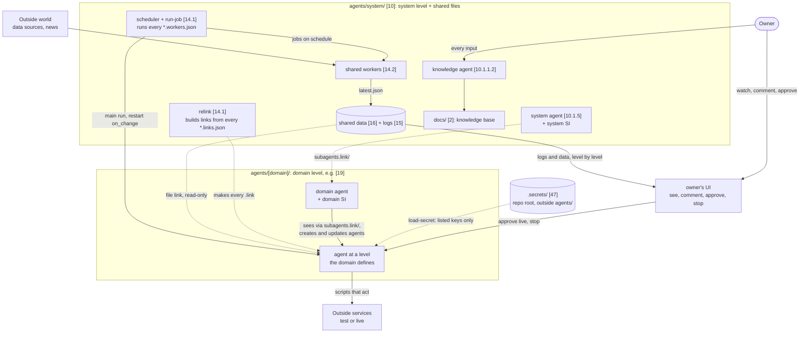

# Agent OS: Overview (v0.2)

The whole Agent OS on one page: the idea, the parts, one diagram of how they fit, how a run goes, how the system improves itself, test and live, and where to read more. Nothing is built yet; this is the design as of file-tree.md v1.32 and decisions D-001 to D-058. Items marked (proposed) are our design and wait for the owner. How each part is built is in architecture.md; every flow step by step is in flows.md. Trading is not part of the system: the prediction-market domain holds it, and its `trading-overview.md` [19.6.5] is the trading layer of this page (D-056).

## Always keep in mind
<!-- k: id=ov-keep-in-mind applies=[0] sources=in-20260930-1603,derived status=decided -->
When you deal with one of these, do this. Each line names the doc that owns the rule. The trading rules (variant names, risk caps, accounts with money) are in the prediction-market domain's `trading-overview.md`.
- **Adding or changing a link:** edit your links file `configs/[name].links.json` and let `relink` build the symlink; never create or delete a symlink by hand (conventions.md `conv-relink-only`, how-to/add-or-change-link.md).
- **Naming a symlink:** it has `.link` in its name, or sits directly inside a `.link` folder such as `subagents.link/`; tools never follow `.link` folders recursively (conventions.md `conv-link-names`, `conv-link-scans`).
- **Needing a secret:** declare the key name in `secret_keys` and let `load-secret` put it into the script's process; never copy a value into a config, doc, log, prompt or link (safety.md `safe-secret-loading`, `safe-secrets-never`).
- **Naming an agent:** check the name is free in the registry [2.18.1]; names are never changed or reused (conventions.md `conv-agent-ids`, `conv-no-rename`).
- **Changing an agent's config, prompt, code or model:** make it a new test version, a new agent with a new name; do not change a running agent in place (safety.md `safe-si-scope`).
- **Changing a config shared by many agents:** a lower layer may only tighten a limit, never loosen it (proposed rule, common/shared-mechanics.md `common-mech-config-merge`).
- **Changing what an agent runs:** change its jobs file `configs/[name].workers.json`; everything it runs is a job there (data-schemas.md `schema-workers-file`).
- **Reading another agent's files:** links are read-only; write only your own real files (common/agent-architecture.md `common-agent-data`).
- **Going live:** test first; only the owner approves going live; an agent never switches itself to live (safety.md `safe-owner-approval`, how-to/promote-to-live.md).
- **Anything changes** (an owner input, an answer to a question, a file): run it through the knowledge agent [10.1.1.2] so the docs and every How it works summary stay in line (docs/README.md, how-to/process-an-input.md).
- **Writing knowledge:** one fact in one place; every other doc points to it (conventions.md `conv-docs-one-fact`, docs/README.md).

## The idea in one paragraph
<!-- k: id=ov-idea applies=[0],[1],[4] sources=in-20260929-1452,in-20260929-1455,D-022,D-033,D-056 status=decided -->
Workers collect data from the outside world on a schedule and write it as JSON and Markdown files. Hundreds of agents of any kind, grouped by domain, link only the files they need into their own folders. Each agent runs on its schedule or when an important file changes: it reads what is new, analyses, decides and acts, in test mode unless the owner approved live. Above the running agents sit managing agents (the system agent, a domain agent for each domain, and the levels each domain defines), each with a self-improvement sub-agent that creates new test versions, compares them and keeps what works. Every agent has the same folder, and everything it has, runs and reads is a file: configs, jobs, links, scripts, logs, data, docs, tests and research. The owner watches, comments and approves from a UI, and a knowledge agent keeps these docs true after every input and change.

## The parts

### Domains and agent levels
<!-- k: id=ov-parts-levels applies=[4],[10],[19] sources=D-013,D-022,in-20260929-1616,in-20260929-1703,D-056 status=decided -->
- `agents/` [4] holds one folder per domain, and `system/` [10] is a domain too (D-013). The first domain is `prediction-market-agents/` [19]; more come later, of any kind.
- Every agent sits at a level, and every level has the same standard folder (D-022): the **system agent** [10] runs all domains and the development of the system; a **domain agent**, such as [19], owns one domain; below it come the levels that domain defines. Every agent has a parent, and a parent sees its children through `subagents.link/`.
- Detail: architecture.md `arch-levels`. The prediction-market domain's own levels (strategy agents and trading variants): its `trading-overview.md`.

### Sub-agents
<!-- k: id=ov-parts-subagents applies=[10.1.1],[19.1.1],[21.1.1] sources=D-008,D-018,D-026,D-033 status=decided -->
- Each level's `.claude/agents/` holds its Claude Code sub-agents (D-008). Every level has a self-improvement (SI) sub-agent, such as [10.1.1.1] for the system and [19.1.1.2] for a domain (D-018).
- System-support roles (development, docs, improvement, analysis, research) are sub-agents of the system level, not folders (D-026). The main one is the knowledge agent `sys-knowledge-agent` [10.1.1.2] (D-033).
- Pre-analysis sub-agents (worker plus AI) digest worker data and hand it as data files to the agents that need it.

### Workers and jobs
<!-- k: id=ov-parts-jobs applies=[14],name:*.workers.json sources=D-007,D-029,in-20260930-0938 status=decided -->
- Workers are scripts (`*.worker.py|js`) that fetch data and write JSON or Markdown (D-007): shared ones in [14.2], agent-only ones in the agent's `scripts/`, like [31].
- Everything an agent runs, scripts and AI runs alike, is a **job** in its own jobs file `configs/[name].workers.json`: on or off, when, where it runs, platform and model (D-029). One scheduler [14.1] runs them all (proposed).

### Data, logs and links
<!-- k: id=ov-parts-data-links applies=[15],[16],[34],[35],name:*.links.json sources=D-002,D-009,D-010,D-014,D-020,D-030,D-031 status=decided -->
- Shared logs [15] and data [16] live in the system, by source (system, services, workers, sub-agents). Each agent's own logs and data are real files in its own folder ([34], [35]).
- An agent reads anything else through **file links**: one symlink per file its logic needs, from anywhere under `agents/`, listed in its links file and built by the shared `relink` script (D-020, D-031).
- Each level sees its children through **child links**: `subagents.link/[child]/` in every content folder (D-030). Nothing is copied.

### Configs and routing
<!-- k: id=ov-parts-configs applies=[11] sources=D-006,D-011,D-014,in-20260929-1455,in-20260929-1537 status=decided -->
- One global `system.config.json` [11.1] (modes with the kill switch, schedules, triggers, notifications; sections proposed) and one own config per agent, like [27.2] (D-006, D-014). The prediction-market domain keeps its trading settings in its own config (its `trading-overview.md`).
- `models.config.json` [11.11] routes every AI-using object to a platform and model (D-011). Claude Code with Opus 5.5 is the default.

### Secrets
<!-- k: id=ov-parts-secrets applies=[47],[48] sources=D-023,D-027,in-20260929-1706 status=decided -->
- Keys live only in `.secrets/` [47] at the repo root, outside `agents/`, git-ignored [48] (D-023; location proposed). All test keys are in one `test/.env` [47.1.1]; `live/.env` [47.2.1] mirrors it, is owner-only and comes later (D-027).
- Configs list only key names (`secret_keys`); the shared `load-secret` loader puts just those keys into the running script. Rules: safety.md.

### Tests and research
<!-- k: id=ov-parts-tests-research applies=name:tests,name:research sources=D-025,in-20260929-2036 status=decided -->
Every level has `tests/` (tests of the prompt and sub-agents, and tests of scripts, each folder with a `tests.config.json`), run by the shared `run-tests` script, and `research/`, an `index.json` history of every research item plus one folder per item (D-025).

### Docs and the knowledge agent
<!-- k: id=ov-parts-docs applies=[1],[2],[10.1.1.2] sources=D-017,D-033,in-20260930-1533 status=decided -->
- The shared docs live in `agents/system/docs/` [2] (D-017); the root `README.md` [1] points there. Each agent has its own `docs/` with links to the shared docs it needs.
- The docs are a layered knowledge base: owner inputs, one file doc per object (file-tree.md), topic docs, history, and an index with the knowledge map and a How it works summary of every file and folder (D-033).
- Every owner input and every system change goes through the knowledge agent [10.1.1.2]. Format and flow: docs/README.md.

### UI and apps
<!-- k: id=ov-parts-ui-apps applies=[43],[53] sources=in-20260929-1455,in-20260929-2044 status=decided -->
- `apps/` [43]: our own apps, such as the project IDE [53], and GitHub repos we clone for our own or the agents' use. The prediction-market domain's dashboard `apps/trading-ui/` [45] sits here too (its `trading-overview.md`).
- What the owner wants to see and do in a UI: vision.md `vis-ui`.
- While we plan, the File Tree page (the explorer) of the project IDE is where the owner reads and edits the design.

## The structure in one diagram
<!-- k: id=ov-diagram applies=[0],[4],[10] sources=D-013,D-018,D-020,D-022,D-023,D-029,D-030,D-031,D-033 status=decided -->
Current structure and the main data flow. The one central scheduler and the location of `.secrets/` are proposed; everything else is decided. The domain box stands for any domain; the prediction-market domain's own diagram is in its `trading-overview.md`.

## How a run goes
<!-- k: id=ov-run-loop applies=[23],[41],[27.4] sources=in-20260929-1452,in-20260929-1455,D-021,D-029 status=decided -->
1. The scheduler starts the agent's main-run job on its schedule. A change to an important file (the job's `on_change` list) cancels the current run and starts a new one; other changes wait for the next run.
2. The agent runs in its own folder, with its own `.claude/` and its own links (proposed, D-021).
3. It reads what is new since its last run, analyses, decides and acts: it acts on the outside world through its scripts; waits or schedules the next run; researches through a sub-agent; or creates, changes or drops workers.
4. Outside actions go only through scripts, which read the mode and the limits. The run ends with a run log and a short summary.

Detail: common/agent-architecture.md `common-agent-run-start`, common/shared-mechanics.md `common-mech-triggers`, flows.md. A trading run with orders: the prediction-market domain's `trading-overview.md`.

## How the system improves itself
<!-- k: id=ov-self-improvement applies=[19.1.1.2],[10.1.1.1] sources=in-20260929-1455,D-018 status=decided -->
- **The wheel** (vision.md `vis-wheel`): create an agent, run it in test, analyse it, reconfigure it as a new test agent, watch the outside world for new models, harnesses and news, and keep the owner in the loop.
- Every level has an SI sub-agent (D-018). The system SI [10.1.1.1] improves shared scripts, configs, routing and docs; a domain's SI, such as [19.1.1.2], compares the agents across its domain. The prediction-market domain's strategy loop: its `trading-overview.md`.
- Every change becomes a new test version, a new agent with its own name; research goes to `research/`, tests to `tests/`. Templates: common/self-improvement-templates.md.

## Test and live
<!-- k: id=ov-test-live applies=[11.1],[47] sources=in-20260929-1455,D-027 status=decided -->
- Every service that acts has a test mode and a live mode, read from config; the mode is also part of the agent's name. The default is test.
- Only the owner approves going live, in the UI. Going live makes a new `...-live` agent (proposed); live keys come in a later phase (D-027).
- Rules: safety.md `safe-test-live`; mechanics: common/shared-mechanics.md `common-mech-modes`; steps: how-to/promote-to-live.md. Live with money: the prediction-market domain's `trading-overview.md`.

## Where things live
<!-- k: id=ov-where applies=[0],[1],[2],[19.6] sources=D-017,D-033,D-056 status=decided -->
| You want | Read |
|---|---|
| Every folder and file, numbered [n] | file-tree.md |
| What the owner wants and why; the owner's open questions | vision.md |
| How it is built, mechanism by mechanism | architecture.md |
| Data flows and owner flows, step by step | flows.md |
| Names, the `.link` rule, IDs | conventions.md |
| Keys, live actions and approvals | safety.md |
| The shape of every file | data-schemas.md |
| One agent inside; shared mechanics; the common prompt; SI templates | common/ |
| Step-by-step runbooks | how-to/ |
| Words; how agents are measured; what comes next | glossary.md, metrics.md, roadmap.md |
| Which logic lives in which files | feature-map.md |
| History; the knowledge map and summaries | decisions.md, changelog.md, inputs/; index/ |
| Trading: strategies, variants, orders, money and risk | the prediction-market domain's `docs/trading-*.md` [19.6] |

## Changelog
- v0.2 (2026-10-07): trading parts moved to the prediction-market domain's `trading-overview.md` (D-056, D-058).
- v0.1 (2026-09-30): created from file-tree.md v1.15, vision.md v0.19 and the owner inputs (D-033). Replaces the old vision/overview.md v0.2 (diagram updated to the current decisions). Adds "Always keep in mind" (in-20260930-1603).
