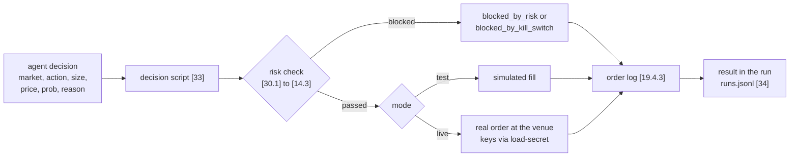
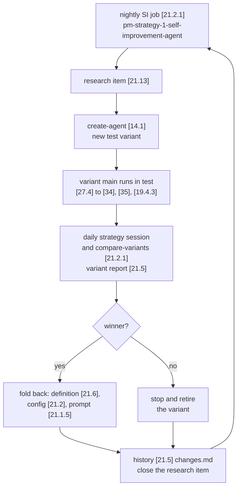

# Agent OS, prediction-market domain: Trading flows (v0.1)

The trading layer of the system's `flows.md`: the order steps of a run, decision to execution with its risk checks, what the domain's dashboard shows, how self-improvement turns at the domain and strategy levels (the strategy loop), and the owner's flows that touch strategies, variants, money and positions. Read it together with `flows.md`; a later trading domain copies it.

## Data flows

### Agent run loop: orders
<!-- k: id=tr-flow-agent-run applies=[19.6.10],[23],[24.5],[33],[34],[35],[46.5] sources=in-20260929-1452,in-20260929-1455,D-021,D-029,D-031,D-056 status=proposed -->
General rule: see `flows.md` (Agent run loop).

A trading agent (a variant like [23]) runs the general loop with orders added. Domain and strategy sessions follow the same loop in their own folders.
- **Read:** its docs include its `strategy.md` [46.5]; its positions are read once they have a home (open, `schema-positions`).
- **Decide:** a decision may be a trade.
- **Act:** a trade goes only through its decision script [33] (`flow-decision`).
- **Log:** each decision in `runs.jsonl` carries the market, the order, its size, price and probability (`tr-schema-runs-jsonl` in `trading-data-schemas.md`).

### Decision to execution: risk checks and executors
<!-- k: id=flow-decision applies=[19.6.10],[33],[30.1],[14.3],[11.1],[19.2.4],[27.2],[19.4.3],[14.1],[34] sources=in-20260929-1452,in-20260929-1455,D-023,D-027,D-056 status=proposed -->
Every service that acts has a test and a live mode taken from config (decided: vision.md `vis-principle-test-first`), and only the owner approves live money. The layer below is our proposal, built on the idea "agents decide, a separate layer executes" (`vis-idea-executor` in `trading-vision-notes.md`, not decided). There is no executor file yet (gap 1 in `trading-feature-map.md`).

1. **Intent.** The agent calls its decision script [33] with one decision: market, action (`buy_yes`, `buy_no`, `sell`, `sell_all`), size, price, its own probability and the reason.
2. **Mode.** The script reads the mode from `effective-config.json`: test, unless the agent is live-allowed (`common-mech-going-live`).
3. **Risk check.** It calls the shared risk check [14.3] through its link [30.1]. The check is code, never the model: first the stop switches (the general one in [11.1] `modes`, then the order stop switch [19.2.4] `kill_switch`), then the [19.2.4] `risk` caps (global, per agent, per venue) as tightened by the agent's `capital_and_risk` [27.2], then for live the [11.1] allowlist and an owner-approved, funded account in [19.2.4] `accounts`.
4. **Blocked.** A failed check stops the order. The service logs `blocked_by_risk` or `blocked_by_kill_switch` in [19.4.3], and the owner gets `risk_limit_hit`.
5. **Test.** The executor records a simulated fill at the current price.
6. **Live.** The executor gets the account's keys through `load-secret` (`flow-secrets`), places the order and records the venue's answer; the owner gets `live_trade`.
7. **Record.** One line per action in the domain's `logs/services/[service]/` [19.4.3], the source of every PnL number (`trading-metrics.md`), and the result in the run's `decisions` in `runs.jsonl` [34].

Open: whether code, the model or both make the decision ([33]); whether the executor gets paper, shadow and backtest modes behind one interface (`vis-idea-executor`); where positions live ([35], `vis-idea-ledger`).

### Logs and runs to the dashboard
<!-- k: id=tr-flow-logs-to-ui applies=[19.6.10],[45],[19.4.3],[35],[19.2.4],[19.4.1.1],[19.5.1.1],[21.4.1.1],[21.5.1.1] sources=in-20260929-1455,D-009,D-010,D-014,D-030,D-056 status=proposed -->
The domain's dashboard [45] (`apps/trading-ui/`, still empty) shows the trading side of the general flow (`flows.md`, `flow-logs-to-ui`). Whether it reads the files directly or through an API is open ([45]).

1. **Writers.** The acting services write their order lines to [19.4.3]; each agent's metrics snapshot [35] carries its money numbers (`tr-schema-metrics-snapshot`).
2. **Level by level.** Strategies through the domain's [19.4.1.1] and [19.5.1.1], variants through the strategy's [21.4.1.1] and [21.5.1.1] (D-030).
3. **Numbers.** Performance comes from each agent's metrics snapshot (`trading-metrics.md`, `metric-ui`).
4. **Back from the owner.** Account approvals and the order stop switch go to [19.2.4]; the general kill switch stays in [11.1] `modes`. The stop switches are checked before every order.

### Self-improvement wheel: domain and strategy
<!-- k: id=tr-flow-si-wheel applies=[19.6.10],[19.1.1.2],[21.1.1.1],[19.2.1],[21.2.1],[19.13],[21.13] sources=in-20260929-1455,D-018,D-025,D-029,D-032,D-056 status=proposed -->
How the wheel (`flows.md`, `flow-si-wheel`) turns in this domain (proposed). What each SI sub-agent owns and does: `common/strategy-si-templates.md`.

| Level | Started by | Reads | Writes |
|---|---|---|---|
| Domain [19.1.1.2] | its nightly job in [19.2.1] | every strategy and its variants through [19.4.1], [19.5.1], [19.6.1] | strategy comparisons, proposals for new strategies or variants, research in [19.13] |
| Strategy [21.1.1.1] | its nightly job in [21.2.1] | its variants through [21.4.1], [21.5.1], [21.6.1], [21.12.3]; research in [21.13] | the strategy loop below (D-032) |

A winner is folded back, a loser retired. No SI sub-agent raises risk caps, and live money stays the owner's decision (`tr-flow-user-promote`).

#### Strategy loop (D-032)
<!-- k: id=flow-si-strategy-loop applies=[19.6.10],[21],[21.1.1.1],[21.1.5],[21.1.12],[21.2],[21.2.1],[21.5],[21.6],[21.13],[23],[27.4],[34],[35],[19.4.3],[49],[14.1],[2.18.1] sources=in-20260930-1453-2,D-032,D-025,D-029,D-056 status=proposed -->
The strategy agent (`pm-strategy-1-agent.opus55-test` for [21]) creates modifications of itself as test variants, compares them and folds a winning change back into itself (D-032, owner). What the SI sub-agent does at each step is in `common/strategy-si-templates.md` (`common-si-loop-steps`); here is the order of jobs and files.

1. **Night.** The strategy's SI job in [21.2.1] starts the SI sub-agent [21.1.1.1] in the strategy's folder. It reads its memory [21.1.12], research [21.13], the latest variant report and history in [21.5], and each variant's logs, data, docs and tests through the strategy's `subagents.link/` folders.
2. **Propose.** It opens a research item in [21.13] for one modification: config, prompt, code or model.
3. **Create.** It runs `create-agent` [14.1]: a new variant folder like [23], named `[strategy-id].[own-name]-v[N].[platform-model]-test` with `parent` set, registered in [2.18.1], linked into the strategy's `subagents.link/` folders by relink, with a `changes.md` that says what differs and tests for the change in its `tests/` like [49].
4. **Run.** The variant's main-run job in its workers file like [27.4] runs in test mode for the test period, writing `runs.jsonl` [34], its lines in the order log [19.4.3] and its metrics snapshot [35].
5. **Compare.** The daily strategy session and its `compare-variants` job in [21.2.1] read every variant through `subagents.link/` and write the variant report to [21.5] `data/variant-report/`, using the comparison rules in `trading-metrics.md` (`metric-comparison`, `metric-champion`).
6. **Decide.** A winning change is folded back: the strategy agent updates its definition in [21.6], its config in [21.2] and its prompt [21.1.5]. A losing variant is stopped and retired (`tr-flow-user-stop`). Either way the cross-variant history `changes.md` in [21.5] and the research item record the result.
7. **Repeat.** The next night starts from the updated strategy.

Open: does `v[N]` belong to the variant or to the strategy ([23]); which variant is the reference after a fold-back (`metric-champion`); may the SI sub-agent retire variants on its own ([21.1.1.1]); should the strategy folder carry the ID suffixes ([21]).

## User flows

### Create a strategy or a variant
<!-- k: id=tr-flow-user-create-agent applies=[19.6.10],[19.6.17.1],[19.1.5],[21],[21.1.1.1],[14.1],[27.2],[27.3],[27.4] sources=in-20260929-1455,D-012,D-022,D-029,D-031,D-032,D-056 status=proposed -->
Creating an agent (`flows.md`, `flow-user-create-agent`) in this domain. Runbook: `how-to/create-strategy-or-variant.md`.

1. **Plan.** The domain agent [19.1.5] plans a new strategy; the strategy agent [21] plans a variant through its SI [21.1.1.1]. Most variants come from a strategy's SI (`flow-si-strategy-loop`).
2. **Scaffold.** For a variant, `create-agent` [14.1] writes the config with its trading fields (`tr-schema-agent-config`), the links file and the jobs file ([27.2], [27.3], [27.4]).

### Review performance: strategies and variants
<!-- k: id=tr-flow-user-review applies=[19.6.10],[45],[19.6.11],[21.5],[34],[35] sources=in-20260929-1455,D-030,D-056 status=proposed -->
Reviewing performance (`flows.md`, `flow-user-review`) in this domain (proposed):

1. The owner opens the dashboard [45]: domains, then strategies, then variants, each with its numbers (`trading-metrics.md`, `metric-ui`).
2. On a strategy: its variant report from [21.5], with the reference variant marked and every challenger beside it.
3. From an agent the owner may approve a live account (`tr-flow-user-promote`).

### Promote test to live with money
<!-- k: id=tr-flow-user-promote applies=[19.6.10],[19.6.17.2],[19.2.4],[47.2.1],[45],[19.4.3],[19.6.11] sources=in-20260929-1455,D-012,D-023,D-027,D-056 status=proposed -->
Only the owner approves giving an agent real money, in the UI (decided: `trading-vision-notes.md` `tr-vis-principle-test-first`). The general steps are in `flows.md` (`flow-user-promote`); runbook: `how-to/go-live-with-money.md`; criteria: `trading-metrics.md`.

1. **Propose.** The strategy agent or its SI finds a variant that meets the live-candidate rules and proposes it.
2. **Fund.** On approval the owner funds an account and puts its live keys, under the same names, in [47.2.1]; [19.2.4] `accounts` marks it funded and owner-approved.
3. **Run live.** The live agent's orders take the live branch of `flow-decision`; the owner gets `live_trade` and `risk_limit_hit`, and the stop switches stop every order at once.

### Stop a trading agent
<!-- k: id=tr-flow-user-stop applies=[19.6.10],[19.6.17.4],[19.2.4],[21.13],[21.5] sources=in-20260929-1455,D-012,D-029,D-030,D-031,D-056 status=proposed -->
Stopping an agent (`flows.md`, `flow-user-stop`) adds two steps for a trading agent. Runbook: `how-to/stop-trading-agent.md`.

- **Live only, after the stop:** open positions are closed and the account is set back to unfunded.
- **Record:** a variant retired by the strategy loop gets its reason in [21.13] and [21.5].

### Review a proposed change: risk and accounts
<!-- k: id=tr-flow-user-review-change applies=[19.6.10],[19.2.4],[2.6],[45] sources=in-20260929-1455,D-031,D-033,D-056 status=proposed -->
Changes to [19.2.4] `risk`, `accounts` and `kill_switch` wait for the owner like the other changes in `flows.md` (`flow-user-review-change`): marked "pending owner" in [2.6], approved or rejected in the UI, with the outcome written on the proposal.

## Changelog
- v0.1 (2026-10-07): created from the trading parts of the system's `flows.md` v0.1 (D-056, D-058).
