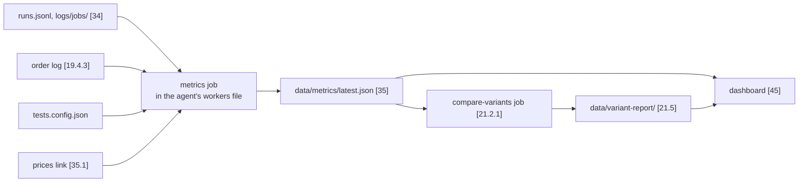

# Agent OS, prediction-market domain: Trading metrics (v0.1)

The trading layer of the system's metrics note: how trading agents are measured on money (capital, PnL and return, win rate, drawdown, calibration, cost per trade), how variants are compared, when a variant wins, goes live, is cut back or is retired, and what the domain's dashboard [45] shows. Read it together with the system's `metrics.md`; a later trading domain copies it. Which metrics decide success is still an open owner question (trading-vision-notes.md, `vis-q-si-scope`), so almost everything here is our proposal. The stored shape of the numbers is in trading-data-schemas.md (`schema-metrics-snapshot`), the logs they come from are in the system's data-schemas.md and in trading-data-schemas.md, and the loop that uses them is in trading-flows.md (`flow-si-strategy-loop`) and common/strategy-si-templates.md.

## What the owner asked for
<!-- k: id=metric-owner-aims applies=[19.6.11],[45],[21],[10.1.1.1],[19.1.1.2],[21.1.1.1] sources=in-20260929-1452,in-20260929-1455,in-20260929-1520,in-20260930-1453-2,D-032,D-056 status=decided -->
- Run and compare many strategy and configuration variants side by side, combine strategies, and keep what works (the system's vision.md, `vis-five-things`, `vis-requirements`).
- See each agent's performance in the UI, with everything behind it (the system's vision.md, `vis-ui`).
- Self-improvement makes each strategy fast, cheap, efficient, simple, understandable and profitable (the system's vision.md, `vis-wheel`).
- The strategy agent tests modifications of itself as variants, compares them and folds a winning change back into itself (D-032).
- Only the owner gives an agent real money.
- The first brief names PnL, win rate, drawdown and calibration as candidate success metrics; which of them decide is open (`tr-metric-open`).

## The metrics

### Capital and money
<!-- k: id=tr-metric-basis applies=[19.6.11],[35],[21.5],[27.2],[34],[19.2.4] sources=derived,D-056 status=proposed -->
General rule: see the system's `metrics.md` (Period and mode).
- **Capital** is the agent's `capital_and_risk.max_capital_usd` from its effective config [34]; for a live agent, its account's `max_capital_usd` in [19.2.4] `accounts`. Returns are measured against it.
- Money is in USD (the currency in the domain config [19.2.4]). AI cost is a cost of the agent, like a fee.
- Besides the general standard periods, a trading agent is measured over the comparison window of a test (`metric-comparison`).

### PnL and return
<!-- k: id=metric-pnl applies=[19.6.11],[19.4.3],[34],[35],[35.1],[19.5.3],name:runs.jsonl*,[14.3],[33] sources=in-20260929-1452,derived,D-056 status=proposed -->
- **Realised PnL:** for every closed position (sold, or the market resolved): exit value minus entry cost minus fees. It comes from the agent's lines in the domain's order log [19.4.3] (`simulated_fill` in test, `filled` and `partial` in live), grouped into positions. Where positions will live is open (trading-data-schemas.md, `schema-positions`).
- **Unrealised PnL:** open positions marked at the latest price, from the prices file the agent links (e.g. `polymarket-prices/latest.json` [19.5.3] through [35.1]).
- **AI cost:** `ai_cost_usd`, as in the system's metrics.md, `metric-cost`.
- `net_pnl = realised + unrealised - ai_cost`; `return_pct = net_pnl / capital * 100`.
- Test fills are simulated at the price seen at decision time, so test PnL ignores slippage and queue position. Proposed later: a fixed slippage in bps per venue, so test results are not too rosy.

### Win rate
<!-- k: id=metric-win-rate applies=[19.6.11],[19.4.3],[35] sources=in-20260929-1452,derived,D-056 status=proposed -->
- `win_rate` = closed positions with realised PnL above zero, divided by all closed positions in the period. A position that resolves at zero is a loss; open positions do not count.
- The number of closed positions (`trades`) is always shown next to it, as its sample size.
- Win rate is never read alone: on prediction markets many small wins on favourites can still lose money. It is read with PnL.

### Drawdown
<!-- k: id=metric-drawdown applies=[19.6.11],[19.4.3],[35],[19.2.4],[27.2],[14.3] sources=in-20260929-1452,derived,D-056 status=proposed -->
- **Equity curve:** capital plus realised plus unrealised PnL, taken at the end of every run (AI cost left out, so it matches the money at risk).
- `max_drawdown_pct`: the largest fall from a peak to a later low, as a percentage of that peak. `current_drawdown_pct`: the fall from the highest peak so far to now.
- The live risk stop in [19.2.4] `risk.domain.drawdown_stop_pct` and an agent's own tighter cap [27.2] use the same definition; the risk check [14.3] applies them before every order (trading-flows.md, `flow-decision`).

### Calibration
<!-- k: id=metric-calibration applies=[19.6.11],name:runs.jsonl*,[33],[24.5],[35],[19.5] sources=in-20260929-1452,derived,D-056 status=proposed -->
For agents that trade on a probability (prediction markets).
- Each trade decision carries the agent's own probability for the outcome it trades (`prob`) and the market price at that moment (`price`), in `runs.jsonl` (proposed fields, trading-data-schemas.md). The trading prompt [24.5] asks for `prob`; the decision script [33] records it.
- When the market resolves, the outcome is 1 or 0. `brier` = the mean of `(prob - outcome)^2` over resolved forecasts; `market_brier` = the same with `price`. Lower is better, and the agent adds value only when its Brier is below the market's.
- `resolved_forecasts` is the sample size; below the minimum the dashboard shows "not enough data".
- Resolution outcomes have no file yet (open: the domain's markets catalog in [19.5] or a resolution worker). Domains without probabilities show calibration as not applicable (open).

### Cost per trade
<!-- k: id=tr-metric-cost applies=[19.6.11],name:runs.jsonl*,[11.11],[19.4.3] sources=in-20260929-1455,D-029,derived,D-056 status=proposed -->
General rule: see the system's `metrics.md` (Cost and tokens).
- `cost_per_trade_usd`: AI cost divided by closed positions.
- The same strategy on a cheaper model is a variant to compare on cost (the model comes from the job or [11.11]).

### Order latency
<!-- k: id=tr-metric-latency applies=[19.6.11],[15.1],[19.4.3] sources=derived,D-056 status=proposed -->
General rule: see the system's `metrics.md` (Latency).
- For a trading agent, reaction time runs from an important change to the order it led to (the action in the order log [19.4.3]). It matters most for fast, event-driven strategies.

### Order errors
<!-- k: id=tr-metric-errors applies=[19.6.11],[19.4.3],[14.3] sources=D-029,D-031,derived,D-056 status=proposed -->
General rule: see the system's `metrics.md` (Errors).
- Orders `blocked_by_risk` in the order log [19.4.3] are a signal too: a strategy that keeps hitting its caps.

## How the numbers are made
<!-- k: id=metric-computation applies=[19.6.11],[14.1],[30],[27.4],[35],[21.2.1],[21.5],[21.5.1],[45] sources=D-029,D-030,derived,D-056 status=proposed -->
No script computes metrics yet (the analytics gap, trading-feature-map.md). Proposed:

1. A shared metrics script in [14.1] (not in the tree yet), linked into each agent's `scripts/` [30] like `run-tests`.
2. Each agent runs it as a `script` job in its own workers file (like [27.4]; e.g. `after main-run`, or hourly), so it writes only its own files: `data/metrics/latest.json` plus a dated copy ([35]; shape trading-data-schemas.md, `schema-metrics-snapshot`).
3. It reads the agent's own logs and data plus its links: `runs.jsonl`, `logs/jobs/`, `tests.config.json`, its prices link, and its lines in the domain's order log [19.4.3] (how an agent reads only its own lines is open).
4. The strategy's `compare-variants` job in [21.2.1] reads every variant's snapshot through `data/subagents.link/` [21.5.1] and writes the variant report `data/variant-report/latest.json` and `latest.md` in [21.5] (`metric-variant-report`). The domain does the same one level up.
5. The dashboard reads the snapshots and the reports (`metric-ui`).

## Comparing agents

### Comparison rules
<!-- k: id=metric-comparison applies=[19.6.11],[21],[21.1.5],[21.1.1.1],[19.1.1.2],[21.5],[21.13],[21.2.3],[19.6.17.2] sources=in-20260929-1452,derived,D-056 status=proposed -->
Two agents are compared only like for like:
1. **Same period.** The same `from` and `to`. Variants that started at different times are compared on the window they both ran, never on "since creation".
2. **Same capital.** The same starting capital; if it differs, compare returns (%), not dollars, and say so.
3. **Test against test.** Test results are compared only with test results. Live results carry real fills, fees and slippage: a live agent is compared with other live agents, or with its own test twin to measure the gap between test and live.
4. **Same markets where it matters.** Variants of one strategy trade the same set of markets; if one trades a subset, compare market by market (the strategy links the domain's markets catalog for this, [21.2.3]).
5. **Enough data.** A minimum period, number of closed positions and number of resolved forecasts (`metric-thresholds`). Below it the result is "not enough data", never a win.
6. **Forward results decide.** Only results from real runs in test mode count for a promotion. A backtest of an LLM strategy can leak the future (trading-vision-notes.md, `vis-idea-backtest-leak`), so backtests feed research [21.13] but never decide.
7. **Net of cost.** Compare net PnL after AI cost, because cheap is one of the owner's goals.

### Champion and challengers at the strategy level (D-032)
<!-- k: id=metric-champion applies=[19.6.11],[21],[21.1.1.1],[21.1.5],[21.2],[21.6],[21.5],[21.13],[23] sources=D-032,in-20260930-1453-2,in-20260929-1452,D-056 status=proposed -->
The owner decided the loop (D-032): the strategy creates variants, tests them, compares them and folds a winning change back into itself. We score it as champion and challengers (trading-vision-notes.md, `vis-idea-champion-challenger`):
- **Champion:** the variant that runs the strategy's current definition ([21.6] definition, [21.2] config, [21.1.5] prompt). At the start that is the first variant.
- **Challengers:** test variants made by the strategy's SI sub-agent [21.1.1.1], each differing from the champion by one change written in its `changes.md`. One change at a time keeps the result readable.
- **Match:** each challenger against the champion under the comparison rules, over the same window, both in test mode.
- **Win:** with enough data, the challenger's net return beats the champion's by at least the win margin, its max drawdown is not worse by more than the drawdown tolerance, its calibration (where measured) is not worse, and its error rate is not higher. Ties go to the cheaper and simpler one.
- **Fold back:** a win updates the strategy's definition, config and prompt, and the winning variant becomes the champion (open: or a fresh variant made from the updated strategy). The old champion is retired after a short overlap (`metric-retirement`).
- **Several challengers:** each is judged against the champion when its own window ends; a challenger that ran against an old champion is judged again, or retired.
- **Record:** the numbers and the verdict go to the research item [21.13] and the cross-variant history `changes.md` in [21.5].

### Variant report
<!-- k: id=metric-variant-report applies=[19.6.11],[21.5],[21.2.1],[21.1.5],[19.1.1.2],[19.5.1],[45] sources=D-030,D-032,derived,D-056 status=proposed -->
- The strategy writes one report a day: `data/variant-report/latest.json` and `latest.md` in [21.5], from its `compare-variants` job in [21.2.1] after its daily session.
- One row per variant: name, parent, the change it tests, days running, the metrics, "not enough data" flags, its role (champion, challenger, retiring) and its verdict against the champion.
- The domain SI sub-agent [19.1.1.2] reads every strategy's report through [19.5.1] to compare strategies across the domain and spot domain-wide issues. Strategies are compared on returns over the same period.

## Promotion, demotion and retirement

### Test to live candidate
<!-- k: id=tr-metric-promote-live applies=[19.6.11],[19.6.17.2],[21],[45],[19.2.4],name:tests.config.json sources=in-20260929-1455,D-025,derived,D-056 status=proposed -->
General rule: see the system's `metrics.md` (Test to live candidate).
A test variant becomes a live candidate only when the general conditions hold and all of these too; then the owner decides in the dashboard [45] (how-to/go-live-with-money.md [19.6.17.2]):
- it is its strategy's champion, or beat it;
- it ran in test mode for at least the minimum period, with enough closed positions and resolved forecasts;
- its net PnL after AI cost is positive, and its max drawdown stayed clearly below the live stop in [19.2.4] `risk.domain.drawdown_stop_pct`;
- its calibration beats the market, where measured.
The strategy agent or its SI sub-agent proposes; only the owner approves (decided: the system's vision.md, `vis-principle-test-first`). The starting live capital is small and set by the owner in [19.2.4] `accounts`.

### Demotion
<!-- k: id=metric-demotion applies=[19.6.11],[19.2.4],[14.3],[19.4.3],[27.4],[45] sources=in-20260929-1455,derived,D-056 status=proposed -->
Demotion is for live agents: less money, a pause, or back to test only.
- **Hard stops in code:** the stop switches (the general [11.1] `modes.kill_switch` and the domain's order stop switch), and `max_daily_loss_usd` and `drawdown_stop_pct` in [19.2.4], stop live orders at once through the risk check [14.3]; the owner gets `risk_limit_hit`.
- **Review triggers:** the live agent trails its own test twin by more than the allowed gap over the comparison window, or its error rate rises. The strategy flags it and proposes to the owner: a lower `max_capital_usd`, a pause (jobs `enabled: false` in its workers file), or a stop.
- Only the owner changes live money. The test twin keeps running, so the strategy keeps learning.
- A test variant is never demoted: a losing challenger is retired.

### Retirement
<!-- k: id=metric-retirement applies=[19.6.11],[2.11.5],[19.6.17.4],[2.18.1],[21.1.1.1],[21.5],[21.13],[23] sources=D-012,D-032,derived,D-056 status=proposed -->
A variant is retired when:
- it lost to the champion at the end of its window;
- it is still "not enough data" after the maximum period (it hardly trades);
- its error rate stays high, or a required input is gone for good;
- it was the champion and a challenger replaced it (after a short overlap);
- the owner says so.
Retiring stops its jobs and marks it `retired` in the registry [2.18.1] (the system's how-to/stop-or-delete-agent.md; for a live agent with positions, how-to/stop-trading-agent.md [19.6.17.4]); its name is never reused (D-012). The reason goes to [21.13] and [21.5]. Whether the SI sub-agent may retire variants itself or only propose it is open ([21.1.1.1]).

## What the dashboard shows
<!-- k: id=metric-ui applies=[45],[19.6.11],[35],[21.5],[16.4],[19.5.1],[21.5.1] sources=in-20260929-1455,D-030,derived,D-056 status=proposed -->
The owner wants to see every agent's performance (decided: the system's vision.md, `vis-ui`). Proposed views:
- **System:** net PnL for test and for live, AI cost today against the daily cap, live capital against the global cap, error count, the state of the stop switches.
- **Domain:** one row per strategy with its champion's return, drawdown and cost, and its number of variants.
- **Strategy:** the variant report, with the champion marked and each challenger beside it with its change and verdict; one return chart for all variants over the same window.
- **Agent:** tiles for net PnL and return, win rate with its trade count, max and current drawdown, Brier against the market with its sample size, cost per run and total, median run time, error rate and tests passing; a PnL and drawdown chart from the dated snapshots; its runs and decisions below.
- "Not enough data" instead of a number below the minimum sample. Test and live are never on one chart without a label.
- The dashboard reads the snapshots and reports level by level through `data/subagents.link/` ([16.4], [19.5.1], [21.5.1]; D-030).

## Thresholds
<!-- k: id=metric-thresholds applies=[19.6.11],[19.2.4],[21] sources=derived,D-056 status=open -->
The owner sets the targets and thresholds ([19.6.11]); none is set yet. Starting values to discuss (our suggestion):

| Threshold | Suggested |
|---|---|
| Test period before a verdict | 14 days (as in the `changes.md` example) |
| Minimum closed positions | 30 |
| Minimum resolved forecasts | 30 |
| Win margin on return | 2 percentage points |
| Drawdown tolerance | 2 percentage points worse at most |
| Error rate limit | 2 % of runs |
| Maximum period without enough data | 30 days, then retire |

Where they will live is open: this note, a section of the domain config [19.2.4], or the strategy's own config.

## Open questions
<!-- k: id=tr-metric-open applies=[19.6.11],[35],[19.4.3],[21],[21.1.1.1],[23] sources=in-20260929-1452,in-20260929-1455,derived,D-056 status=open -->
- Which metrics decide success, and what may self-improvement change without the owner (trading-vision-notes.md, `vis-q-si-scope`)?
- Where positions live ([35], trading-vision-notes.md `vis-idea-ledger`) and where market resolutions come from: PnL, win rate and calibration need both.
- After a fold-back, is the champion the winning variant or a fresh variant made from the updated strategy? Does `v[N]` belong to the variant or to the strategy ([23])?
- May the SI sub-agent retire variants itself ([21.1.1.1])?
- How does an agent read only its own lines of the domain's order log [19.4.3]: a link, a filtered copy, or a per-agent file?
- How are calibration and win rate defined for domains without probabilities or resolutions?
- Are meta-agents and combined strategies (the system's vision.md, `vis-idea-meta-agents`) measured the same way?

## Changelog
- v0.1 (2026-10-07): created from the trading parts of metrics.md v0.1 (D-056, D-058). Copy trading is no longer named among the domains without probabilities (D-056).
