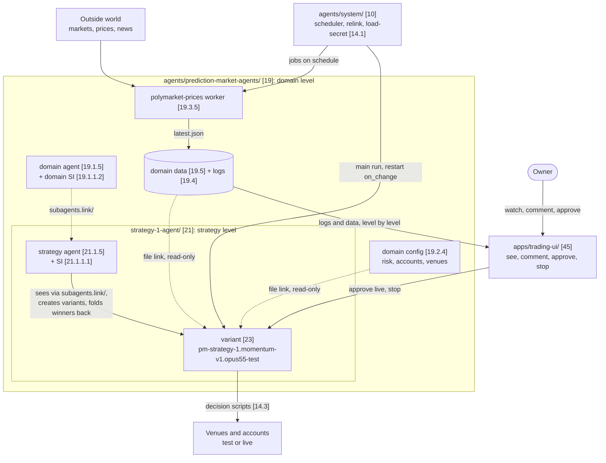

# Agent OS, prediction-market domain: Trading overview (v0.1)

The trading layer of the system's overview: the trading rules to keep in mind, the trading idea, this domain's strategy and trading-agent levels, its config and dashboard, a diagram of the domain, a trading run with orders, the strategy loop, live with money, and where the trading notes live. Read it together with the system's `overview.md`; a later trading domain copies it.

## Always keep in mind
<!-- k: id=tr-ov-keep-in-mind applies=[19] sources=in-20260930-1603,derived,D-056 status=decided -->
General rule: see the system's `overview.md` (Always keep in mind). In this domain, also:
- **Naming a trading agent:** a variant starts with its strategy, `[strategy-id].[own-name]-v[N].[platform-model]-[test|live]`; names are never changed or reused (`trading-conventions.md` `conv-variant-names`; the system's conventions.md `conv-no-rename`).
- **Changing a trading agent's config, prompt, code or model:** make it a new test variant with a new name; do not change a running variant in place (the system's safety.md `safe-si-scope`).
- **Changing a config shared by many agents:** a lower layer may only tighten risk caps, never loosen them (proposed rule, `trading-safety.md`).
- **Going live:** only the owner approves an account with money (`trading-safety.md`, `how-to/go-live-with-money.md`).

## The idea in one paragraph
<!-- k: id=tr-ov-idea applies=[19],[21],[23],[45] sources=in-20260929-1452,in-20260929-1455,D-022,D-032,D-033,D-056 status=decided -->
Hundreds of trading agents, grouped by domain and by strategy, link only the files they need into their own folders, decide, and act through orders, in test mode unless the owner approved real money. Prediction markets are the first trading domain; a later trading domain (crypto, content-driven, combinations) is copied from this one when needed (D-056). Above the trading agents sit the strategy agents, one level below the domain agent, each with a self-improvement sub-agent that creates new test variants, compares them and keeps what works. The owner watches, comments and approves money from a UI; this domain's own dashboard is `apps/trading-ui/` [45], a Next.js UI, empty for now.

## The parts

### Domain and agent levels
<!-- k: id=tr-ov-parts-levels applies=[19],[21],[23] sources=D-013,D-022,D-032,in-20260929-1616,in-20260929-1703,D-056 status=decided -->
- Below its domain agent [19], this domain defines two levels, each a folder with the same standard layout (D-022): a **strategy agent** [21] owns one strategy; under each strategy sit its **trading variants** [23].
- A trading variant has one platform/model and one mode, and is named strategy first, e.g. `pm-strategy-1.momentum-v1.opus55-test` (D-032).
- Detail: `trading-architecture.md`.

### Configs
<!-- k: id=tr-ov-parts-configs applies=[19.2.4] sources=D-006,D-011,D-014,in-20260929-1455,in-20260929-1537,D-056 status=decided -->
- The domain's own config `prediction-market-agents.config.json` [19.2.4] holds what the system config held for trading: risk limits, trading accounts, venues, fees, market filters, default workers, the currency, the order stop switch and trade notifications (proposed default, D-058).

### The domain's dashboard
<!-- k: id=tr-ov-parts-ui-apps applies=[45] sources=in-20260929-1455,in-20260929-2044,D-056 status=decided -->
- `apps/trading-ui/` [45] is this domain's dashboard. It stays in `apps/` where the owner put it (proposed default, D-058); it is empty for now and maybe never needed (D-045).
- The plan: a Next.js API and UI where the owner sees every agent in full, creates agents from a plain input, comments, asks questions, approves real money, and stops or deletes agents (the system's vision notes `vis-ui`).

## The domain in one diagram
<!-- k: id=tr-ov-diagram applies=[19],[21],[23],[45] sources=D-013,D-018,D-020,D-022,D-023,D-029,D-030,D-031,D-032,D-033,D-056 status=decided -->
This domain inside the system, with the main data flow. The one central scheduler is proposed, and so are the domain's config, its price collector and the place of the dashboard (D-058). The system part is in the system's `overview.md`.

## How a trading run goes
<!-- k: id=tr-ov-run-loop applies=[23],[33],[14.3] sources=in-20260929-1452,in-20260929-1455,D-021,D-029,D-056 status=decided -->
A trading agent runs the system's run loop (the system's `overview.md`, How a run goes) with orders:
- Its actions are buy, sell and sell all, next to waiting or scheduling the next run, research through a sub-agent, and creating, changing or dropping workers.
- Orders go only through decision scripts, its own like [33] and the domain's shared ones in `scripts/decisions/` [14.3], which read the mode and the risk limits.

Detail: `common/trading-agent-architecture.md`, `trading-flows.md` `flow-decision`.

## How the domain improves its strategies
<!-- k: id=tr-ov-self-improvement applies=[21],[21.1.1.1],[19.1.1.2] sources=in-20260929-1455,in-20260930-1453-2,D-018,D-032,D-056 status=decided -->
- **The strategy loop** (D-032): the strategy agent, through its SI sub-agent [21.1.1.1], creates modifications of itself as new test variants, compares them, and folds a winning change back into the strategy's definition, config and prompt.
- The domain SI [19.1.1.2] compares strategies across the domain.
- Every change becomes a new test variant with its own name. Templates: `common/strategy-si-templates.md`.

## Test and live with money
<!-- k: id=tr-ov-test-live applies=[19.2.4],[47],[45] sources=in-20260929-1455,D-027,D-056 status=decided -->
- In this domain, live means real money: only the owner approves an account with money, in the UI.
- Rules: `trading-safety.md`; steps: `how-to/go-live-with-money.md`; the accounts: `index/accounts.md`.

## Where the trading notes live
<!-- k: id=tr-ov-where applies=[19.6] sources=D-017,D-033,D-056 status=decided -->
Each note is the trading layer of the system note with the same name without `trading-`; read the two together.

| You want | Read |
|---|---|
| The trading layer of this page | trading-overview.md |
| Strategy and trading-agent levels, variants | trading-architecture.md |
| Strategy and variant names, account ids, decision scripts | trading-conventions.md |
| The live gate with accounts, risk limits, the order stop switch | trading-safety.md |
| The domain config, decisions, order log, positions, metrics snapshot | trading-data-schemas.md |
| Decision to execution, the strategy loop, going live with money | trading-flows.md |
| PnL, win rate, drawdown, calibration, promotion thresholds | trading-metrics.md |
| Trading words | trading-glossary.md |
| MVP strategies, venues, live trading, trading questions | trading-roadmap.md |
| Which trading logic lives in which files | trading-feature-map.md |
| The trading agent inside; the trading prompt; strategy SI templates | common/ |
| Runbooks with money | how-to/ |
| Trading accounts | index/accounts.md |

## Changelog
- v0.1 (2026-10-07): created from the trading parts of the system's `overview.md` v0.1 (D-056, D-058).
